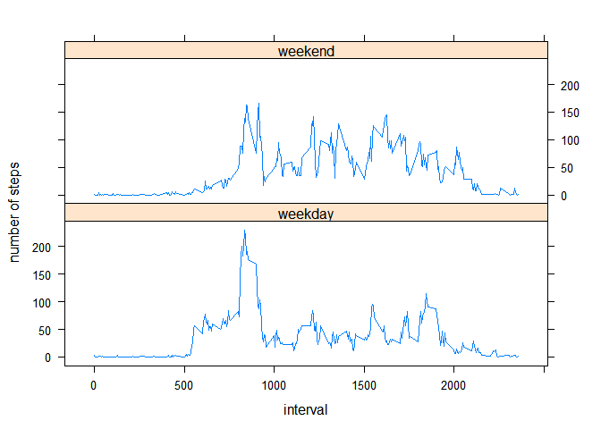

# Reproducible Research: Peer Assessment 1
Han Dehai  
`r date()`  


## Loading and preprocessing the data
First we need the dataset unzipped and loaded.

```r
unzip("activity.zip")
actdata <- read.csv("activity.csv")
```


## What is mean total number of steps taken per day?
The "dplyr" library was used. The raw dataset was transformed to another which grouped by date. Then total steps per every day was calculated using *summarise*, and a histogram was plotted. Lastly *summary* was used to get the mean and median of the total number of steps taken per day.

```r
library(dplyr, warn.conflicts = F)
by_date <- group_by(actdata, date)
stepsperday <- summarise(by_date, steps_per_day = sum(steps, na.rm=T))
hist(stepsperday$steps_per_day, main = "Histogram of steps_per_day", 
     xlab = "steps_per_day")
```

 

```r
ss <- summary(stepsperday$steps_per_day)
ss
```

```
##    Min. 1st Qu.  Median    Mean 3rd Qu.    Max. 
##       0    6778   10400    9354   12810   21190
```
Here we can see that the mean is 9354, and the median is 1.04\times 10^{4}.


## What is the average daily activity pattern?
For this question, the data was grouped by interval, and the average number of steps taken across all days was calculated.

```r
by_interval <- group_by(actdata, interval)
stepsperinterval <- summarise(by_interval, 
                              steps_per_interval = mean(steps, na.rm=T))
maxsteps <- max(stepsperinterval$steps_per_interval)
whichmax <- filter(stepsperinterval, steps_per_interval==maxsteps)[[1,1]]
with(stepsperinterval,
     plot(interval, steps_per_interval, type = "l", xaxt = "n",
     main = "Average Steps across all days", xlab = "Time"))
xlabtext <- seq(0, 2100, 300)
axis(1, at = xlabtext, labels = xlabtext)
text(whichmax, maxsteps, paste("(",whichmax,",",round(maxsteps,2),")"), pos = 4)
```

 

The time series plot suggested that people usually move duaring 6am to 9pm, and there were four peaks at about 8:30, 12:00, 15:00 and 19:00, among which the highest was 206.17 steps at the 835 interval.


## Imputing missing values
There are 2304 missing values for *steps*, which is 13.11% of total number of rows.   
Pattern of NAs can be shown like that.

```r
attach(actdata)
plot(interval, date, cex=0.01)
text(interval, date, ifelse(is.na(steps),"o",""))
```

 

```r
detach(actdata)
```
The plot suggested that missing values exit only on 8 particular days and exactly all the 60/5x24x8 values missed. So the mean value of every interval across all days might be the better choice for imputing.  
*cast* in *reshape2* was used to simplify the imputing work. The mean value of every interval were copied to those days on which total number equals to zero.

```r
library(reshape2)
mactdata <- melt(actdata, id=c("date","interval","steps"))
reactdata <- dcast(mactdata, interval~date)
```

```
## Using steps as value column: use value.var to override.
```

```r
ind_na <- which(stepsperday$steps_per_day==0)
reactdata[,ind_na+1] <- stepsperinterval[,2]
remactdata <- melt(reactdata, id=c("interval"))
colnames(remactdata) <- c("interval", "date", "steps")
```


```r
newstepsperday <- colSums(reactdata)[-1]
hist(newstepsperday, main = "Histogram of new_steps_per_day", 
     xlab = "new_steps_per_day")
```

 

```r
nss <- summary(newstepsperday)
nss
```

```
##    Min. 1st Qu.  Median    Mean 3rd Qu.    Max. 
##      41    9819   10770   10770   12810   21190
```
Here we can see that the mean is 1.077\times 10^{4}, and the median is 1.077\times 10^{4}.  
In the first part of the assessment, NA values of that 8 days were considered as zero and they were imputted by the mean value in this part. Comparing the two histograms, the "8 days" was moved from the "0~5000" bar to the "10000~15000" bar, because total number of steps for the averaged day was 1.0766189\times 10^{4}.  
As mean values were used to imput the NA values, the mean and median values were much closer than that in the first part of the assessment.   
1.077\times 10^{4} - 1.077\times 10^{4} = 0   
1.04\times 10^{4} - 9354 = 1046   


## Are there differences in activity patterns between weekdays and weekends?
*isweekend* in *chron* library was used to disdiguish weekends from weekdays.
*xyplot* in *lattice* library was used to explore the activity patterns between weekdays and weekends.

```r
library(chron)
wremactdata <- mutate(remactdata, isweekend = as.factor(ifelse(
        is.weekend(as.chron(as.Date(date))), "weekend", "weekday")))

weekdaydata <- filter(wremactdata, isweekend == "weekday")
weekenddata <- filter(wremactdata, isweekend == "weekend")

wd_by_interval <- group_by(weekdaydata, interval)
weekdaydata <- summarise(wd_by_interval, isweekend = unique(isweekend),
                         steps_per_interval = mean(steps, na.rm=T))

we_by_interval <- group_by(weekenddata, interval)
weekenddata <- summarise(we_by_interval, isweekend = unique(isweekend),
                         steps_per_interval = mean(steps, na.rm=T))

weekdata <- rbind(weekdaydata, weekenddata)

library(lattice)
xyplot(steps_per_interval ~ interval | isweekend, data = weekdata, type = "l",
       layout = c(1,2), ylab = "number of steps")
```

 

It seems that people move much more in the morning than in the afternoon on weekdays, while on weekends the difference is not too big.
